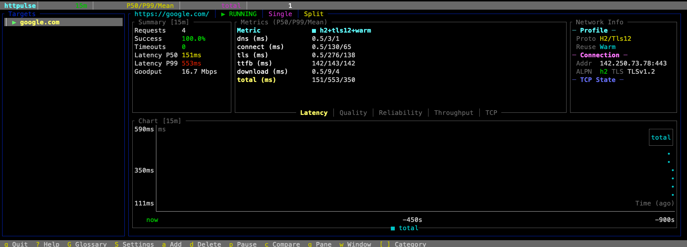

# Monitor Network



[繁體中文](docs/README.zh-TW.md) | [简体中文](docs/README.zh-CN.md) | [日本語](docs/README.ja.md)

A real-time HTTP latency and network quality monitoring tool with an interactive terminal UI. Built in Rust for high performance and reliability.


[](https://github.com/DennySORA/httpulse/actions/workflows/ci.yml)
[](https://github.com/DennySORA/httpulse/releases)

## Quick Install

**Linux / macOS:**
```bash
curl -fsSL https://raw.githubusercontent.com/DennySORA/httpulse/main/install.sh | bash
```

**Or with wget:**
```bash
wget -qO- https://raw.githubusercontent.com/DennySORA/httpulse/main/install.sh | bash
```

**Custom install directory:**
```bash
INSTALL_DIR=~/.local/bin curl -fsSL https://raw.githubusercontent.com/DennySORA/httpulse/main/install.sh | bash
```

**Specific version:**
```bash
VERSION=v0.1.0 curl -fsSL https://raw.githubusercontent.com/DennySORA/httpulse/main/install.sh | bash
```

See [Installation](#installation) for more options.

## Features

### Real-Time Monitoring
- **Live HTTP Probing**: Continuously monitors target URLs with configurable intervals
- **Multi-Target Support**: Monitor multiple endpoints simultaneously
- **Profile Comparison**: Compare different HTTP configurations side-by-side

### Comprehensive Metrics

#### Latency Metrics
- **DNS**: Domain name resolution time
- **Connect**: TCP handshake duration
- **TLS**: TLS/SSL handshake time
- **TTFB**: Time to First Byte (server processing time)
- **Download**: Content download time
- **Total**: Complete request lifecycle

#### Quality & Reliability
- **RTT**: Round-trip time from TCP_INFO (kernel-level accuracy)
- **RTT Variance**: Network path stability indicator
- **Jitter**: Inter-probe latency variation
- **Retransmissions**: TCP packet loss indicator
- **Reordering**: Out-of-order packet events
- **Probe Loss Rate**: Application-level failure rate

#### Throughput & TCP State
- **Goodput**: Application-layer throughput (bps)
- **Bandwidth Utilization**: Usage vs configured link capacity
- **cwnd**: TCP congestion window size
- **ssthresh**: Slow-start threshold

### Configurable Profiles
- **HTTP/1.1 & HTTP/2**: Test different protocol versions
- **TLS 1.2 & TLS 1.3**: Compare TLS version performance
- **Connection Reuse**: Warm (keep-alive) vs Cold (fresh connection) modes

### Interactive TUI
- **Real-time Charts**: Visualize metrics over time
- **Category Tabs**: Organized metrics display (Latency/Quality/Reliability/Throughput/TCP)
- **Multiple View Modes**: Split, Chart-only, Metrics-only, Summary
- **Time Windows**: 1min, 5min, 15min, 60min aggregation periods
- **Glossary**: Built-in terminology explanations

## Installation

### Quick Install (Recommended)

```bash
curl -fsSL https://raw.githubusercontent.com/DennySORA/httpulse/main/install.sh | bash
```

### Download Binary

Download pre-built binaries from [GitHub Releases](https://github.com/DennySORA/httpulse/releases):

| Platform | Architecture | Download |
|----------|--------------|----------|
| Linux | x86_64 | `httpulse-x86_64-unknown-linux-musl.tar.gz` |
| Linux | ARM64 | `httpulse-aarch64-unknown-linux-musl.tar.gz` |
| macOS | x86_64 (Intel) | `httpulse-x86_64-apple-darwin.tar.gz` |
| macOS | ARM64 (Apple Silicon) | `httpulse-aarch64-apple-darwin.tar.gz` |
| Windows | x86_64 | `httpulse-x86_64-pc-windows-msvc.zip` |

### Build from Source

**Prerequisites:**
- Rust 1.92 or later
- libcurl with HTTP/2 support

```bash
git clone https://github.com/DennySORA/httpulse.git
cd httpulse
cargo build --release
```

The binary will be available at `target/release/httpulse`.

### Cargo Install

```bash
cargo install --git https://github.com/DennySORA/httpulse.git
```

## Usage

### Basic Usage

```bash
# Monitor default target (google.com)
httpulse

# Monitor specific target
httpulse -t https://example.com

# Monitor multiple targets
httpulse -t https://google.com -t https://cloudflare.com -t https://github.com
```

### Command Line Options

| Option | Description | Default |
|--------|-------------|---------|
| `-t, --target <URL>` | Target URL to probe (repeatable) | `https://google.com` |
| `--refresh-hz <N>` | UI refresh rate in Hz | `10` |
| `--ebpf <MODE>` | eBPF mode: off\|minimal\|full | `off` |

### Keyboard Shortcuts

#### Navigation
| Key | Action |
|-----|--------|
| `Up/Down` or `j/k` | Select target |
| `Tab` | Cycle through profiles |
| `[` / `]` | Switch metrics category |

#### Actions
| Key | Action |
|-----|--------|
| `a` | Add new target |
| `d` | Delete selected target |
| `p` | Pause/Resume probing |
| `c` | Toggle compare mode |

#### View Controls
| Key | Action |
|-----|--------|
| `g` | Cycle pane mode (Split/Chart/Metrics/Summary) |
| `w` | Cycle time window (1m/5m/15m/60m) |
| `1-8` | Toggle metric series on chart |

#### General
| Key | Action |
|-----|--------|
| `?` | Show help |
| `G` | Show glossary |
| `S` | Open settings |
| `q` | Quit |

### Adding Targets

When adding a target with `a`, you can specify custom profiles:

```
https://example.com h2+tls13+warm h1+tls12+cold
```

Profile format: `<http>+<tls>+<conn>`
- HTTP: `h1`, `h2`
- TLS: `tls12`, `tls13`
- Connection: `warm` (reuse), `cold` (fresh)

### Settings

Press `S` to open settings and configure:
- **UI refresh rate**: Adjust update frequency
- **Link capacity**: Set bandwidth for utilization calculation
- **Probe interval**: Time between probes
- **Timeout**: Maximum probe duration
- **DNS**: Enable/disable DNS resolution timing

## Understanding the Metrics

### Statistics Display

Metrics are shown as **P50/P99/Mean**:
- **P50**: Median value (50th percentile)
- **P99**: 99th percentile (worst 1% of samples)
- **Mean**: Arithmetic average

### Interpreting Results

| Metric | Good | Warning | Critical |
|--------|------|---------|----------|
| Success Rate | ≥99% | 95-99% | <95% |
| Latency P99 | <100ms | 100-500ms | >500ms |
| Retransmissions | 0 | 1-3 | >3 |

### TCP State Metrics (Linux only)

TCP_INFO metrics (`cwnd`, `ssthresh`, `rtt`, `rttvar`, `retrans`, `reordering`) are extracted from the kernel via socket options. These provide more accurate measurements than application-level timing.

## Architecture

```
┌─────────────────────────────────────────────────────────────┐
│                         Main Thread                          │
│  ┌─────────┐    ┌──────────┐    ┌─────────────────────────┐│
│  │ AppState│◄───│  UI Loop │◄───│ crossbeam channel (rx)  ││
│  └─────────┘    └──────────┘    └─────────────────────────┘│
└─────────────────────────────────────────────────────────────┘
                                            ▲
                    ┌───────────────────────┴───────────────────────┐
                    │                                               │
        ┌───────────┴───────────┐               ┌───────────────────┴───────────┐
        │    Worker Thread 1    │               │      Worker Thread N          │
        │  ┌─────────────────┐  │               │  ┌─────────────────────────┐  │
        │  │  ProbeClient    │  │      ...      │  │      ProbeClient        │  │
        │  │  (libcurl)      │  │               │  │      (libcurl)          │  │
        │  └─────────────────┘  │               │  └─────────────────────────┘  │
        └───────────────────────┘               └───────────────────────────────┘
```

## Requirements

- **Operating System**: Linux (full features), macOS/Windows (limited TCP metrics)
- **Rust**: 1.92+
- **Dependencies**: libcurl with HTTP/2 support

## License

MIT License - see [LICENSE](LICENSE) for details.

## Contributing

Contributions are welcome! Please feel free to submit issues and pull requests.
